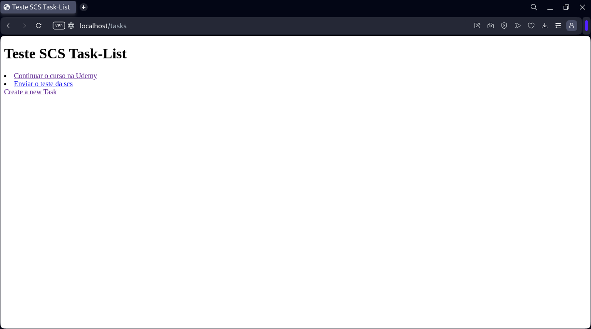
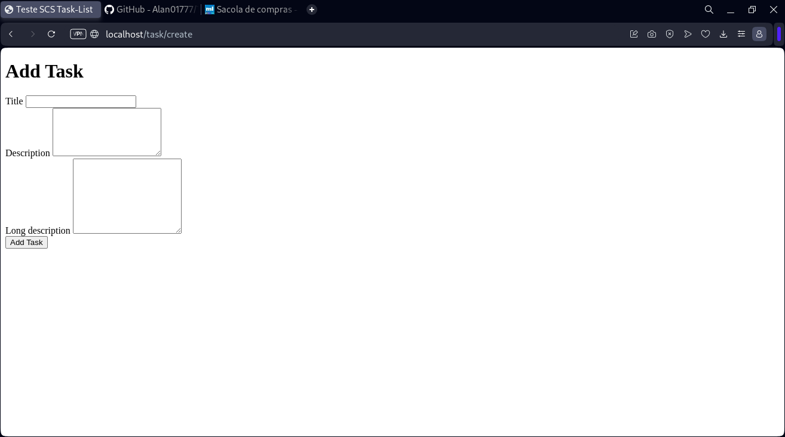
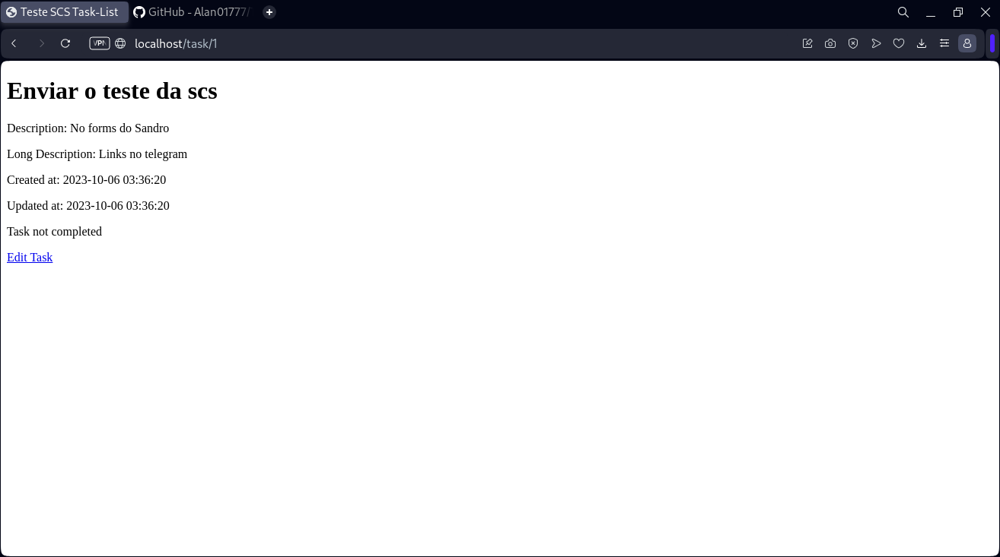
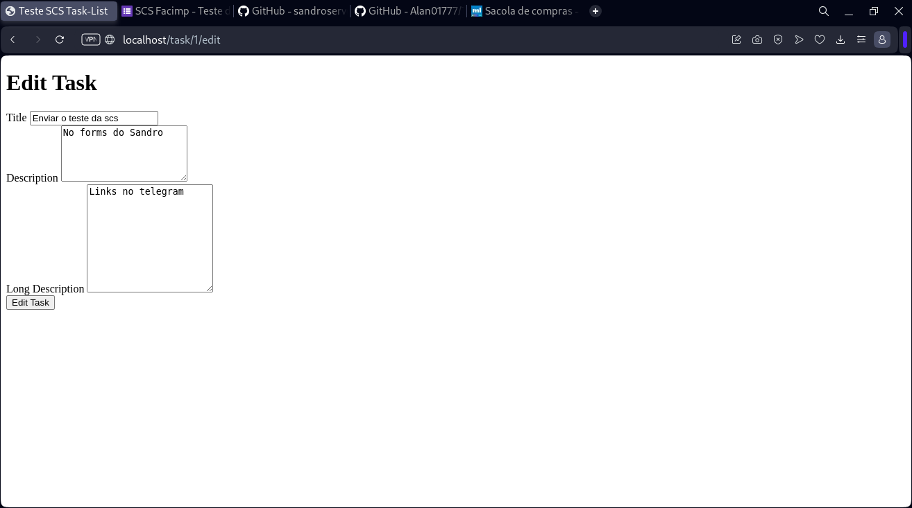
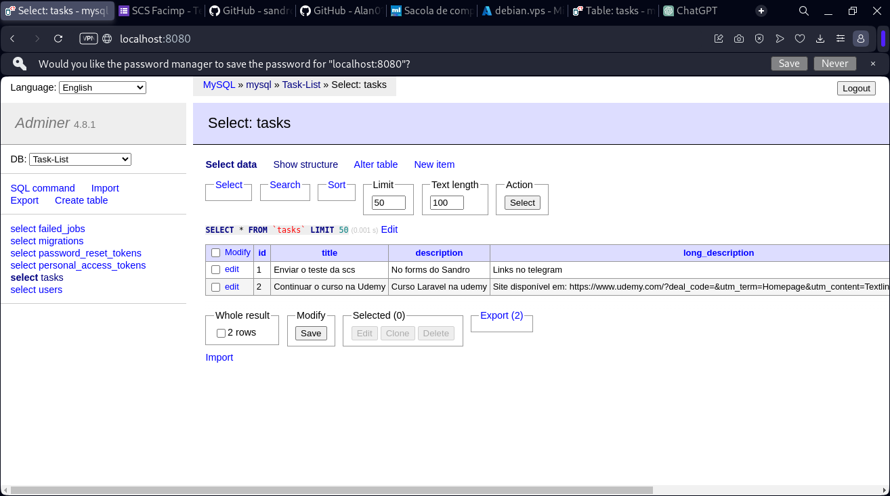

## Teste SCS
Nome: Francisco Alan Oliveira da Costa Alves

Núclo: DevOps

Faculdade: Facimp

Curso: Sistemas de Informação

Semestre: 4° semestre

# Sobre o APP
A aplicação foi feita em laravel e utiliza o banco de dados Mariadb, nginx (reverse-proxy), adminer e o próprio Laravel. O objetivo do App é proporcionar ao usuário a possibilidade de criar uma lista de tarefas (task list) que pode ser modificada ou deletada do banco de dados após sua criação.

# Configuração do APP
1. Clone o repositório
```bash
git clone https://github.com/Alan01777/Teste-SCS.git
cd Teste-SCS
```

2. Crie o arquivo .env (veja a próxima seção para configurar o .env)
```bash
cp .env.example .env
```

3. Configure o .env que foi gerado no comando anterior usando o modelo abaixo como exemplo:
```bash
DB_CONNECTION=mysql
DB_HOST=mysql
DB_PORT=3306
DB_DATABASE=Task-List
DB_USERNAME=root
DB_PASSWORD=root
DB_ROOT_PASSWORD=root
```

4. Subindo os containers. Pode ser necessário usar o super usuário (sudo) quando se executar os comandos do docker.
```bash
docker compose up -d
```

5. Instalando as dependências do laravel
```bash
docker compose exec laravel-app bash -c "composer install"
docker compose exec laravel-app bash -c "php artisan key:generate"
```

6. Gerando as migrations necessárias. Pode ser necessário aguardar alguns instantes para até que o banco de dados esteja pronto para receber conexões.
```bash
docker compose exec laravel-app bash -c "php artisan migrate"

```
## App rodando Localmente
Tela inicial:

Tela para criar as tarefas (tasks):

Tela para exibir as tarefas (tasks):

Tela para editar as tarefas (tasks):

Banco de dados acessado pelo adminer:


## App em nuvem
O app foi testado em uma VPN usando o Microsoft Azure. Para acessar o VPS via navegador use o link:
http://52.146.5.48
